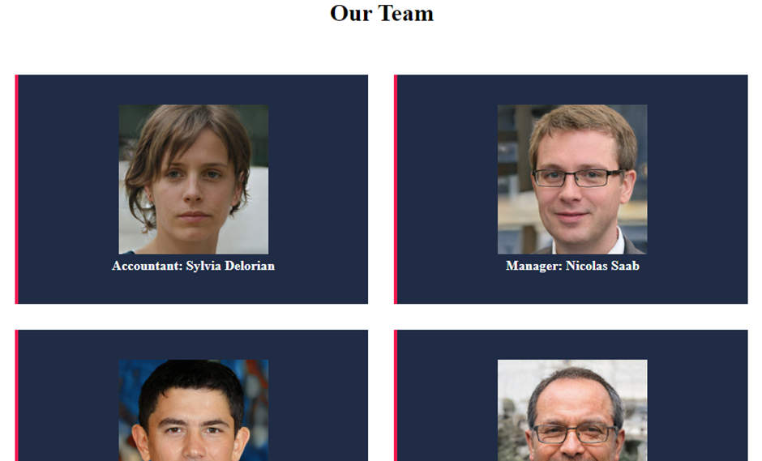

# CarTrust
A simple web site with functions of selecting required services and booking a visit

The application provides a convenient service of arranging visits for a client to a car workshop and give an opportunity 
to the client to select certain services the client wants to order.\

There is also developed functionality for a car workshop to manage available services and visit requests.
The application supports login, logout register a new user, and recovery password functionality.\
It also has search functions on the services page, managing promotions interface and user accounts management panel.

### Available functions

For the public part of the site
- select services to order 
- explore service details
- browse cart content
- request for a visit
- browse contact and the "Our team" page 

Workshop administrative part
- Manage available services
- Edit service details
- Manage users
- Manage user accounts
- Manage requests for a visit
- Manage promo banners for the Main page

## Platform
ASP.NET v4.5

## Language
C#|HTML|Javacript

## Database
MSSQL

## Screenshots

### Main page

### Services page

### Client cart page

### Our Team page

### Contacts page

